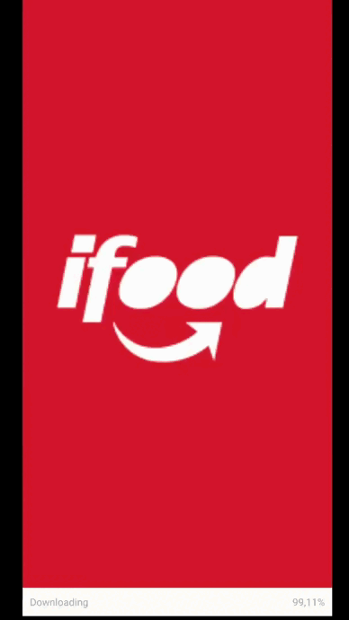

<h1 align='center'>Clone do iFood - DIO</h1>

## Índice

- [Tecnologias Utilizadas](#Tecnologias-Utilizadas)
- [Imagem do Projeto](#Imagem-do-Projeto)
- [Instalação e Inicialização](#Instalação-e-Inicialização)

&nbsp;

Projeto original  [Pablo Henrique](https://github.com/pablohdev/app-ifood-clone)

&nbsp;

## Tecnologias Utilizadas

---
&nbsp;

- [Expo](https://expo.dev/)
- [React Native](https://reactnative.dev/)
- [TypeScript](https://www.typescriptlang.org/)
- [React Navigation](https://reactnavigation.org/)
- [Ionicons (Vector Icons)](https://ionic.io/ionicons)


&nbsp;

## Imagem do Projeto

---

&nbsp;



&nbsp;

## Instalação e Inicialização

---
&nbsp;

- Instale as dependências com

```sh
yarn install
```

- Inicie o servidor com

```sh
yarn start
```
